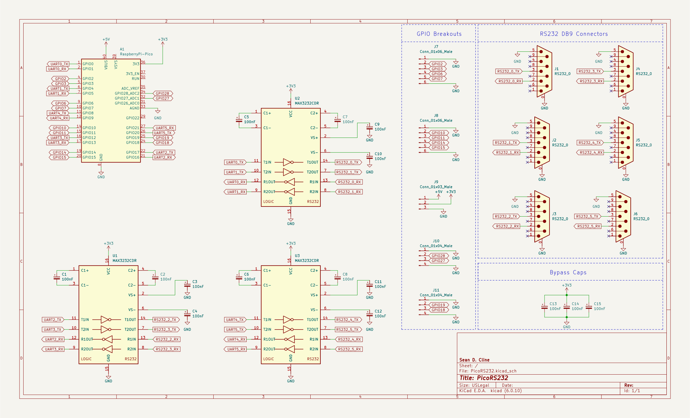

# PicoRS232

>⚠ I haven't had this PCB design manufactured yet so there may be bugs. Here be dragons.

This PCB connects 6 RS232 UART ports to a Raspberry Pi Pico.
 1) Two ports are connected to the RP2040's 2 hardware UARTs.
 2) Four more ports are connected to the RP2040's PIO drivers for software UART.

The TX/RX pins line up with those from the [Pico UART Bridge](https://github.com/harrywalsh/pico-hw_and_pio-uart-gridge/tree/HW_and_pio_uarts) firmware so that firmware should work out-of-the-box.

Note: Flow control is not supported in this design. Only TX/RX are connected to each port. This was done to keep the BOM low and software simple.

## Schematic

## Board

